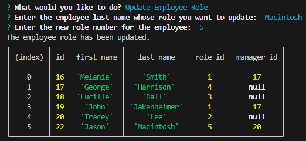

# Employee-Tracker

## Badge
[]
 

## Table of Contents
- [Description](#description)
- [Screenshots](#screenshots)
- [Usage](#usage)
- [What I Have Learned](#what-i-have-learned)
- [Credits](#credits)
- [Licenses](#licenses)
 

## Description
Challenge 12 coursework for UT bootcamp. Uses Node.js, Express.js, Inquirer, and SQL.  
This program runs in the command line, taking input from the user in regards to  
an employee database, with three tables - department, role, and employee.  
The user can select from a menu, if they wish to view all departments, roles, and employees,  
if they wish to add a department, role, or employee, and if they wish to update an employee's role.  
They can exit the program by selecting 'Quit'.  

## Screenshots
---Main screen---  

---View Departments---  

---View Roles---  

---View Employees---  

---Add Department---  

---Add Role---  

---Add Employee---  

---Update Employee's Role---  

---Quitting---  

## Usage
Simply click on the video and watch the magic happen.    
Link to the video: https://drive.google.com/file/d/13yjedJbEI6ZD0kAO4XxpbbCy4pkz42L9/view  

## What I Have Learned
I have learned how to utilize SQL databases within the application,  
as a test of configuring queries and creating tables.  
Taking forth previous knowledge of express.js, node.js, and inquirer,  
and combining it with new SQL definitions has expanded my mind  
on what it means to be a developer.  

## Credits
Made by Allie Stewart.  
Helpful information from my module 12 notes,  
and https://www.npmjs.com for NPM knowledge,  
as well as the good ol' https://stackoverflow.com for  
miscellaneous questions about SQL database implementation with node.  

## Licenses
Please refer to the LICENSE in the repository.  

